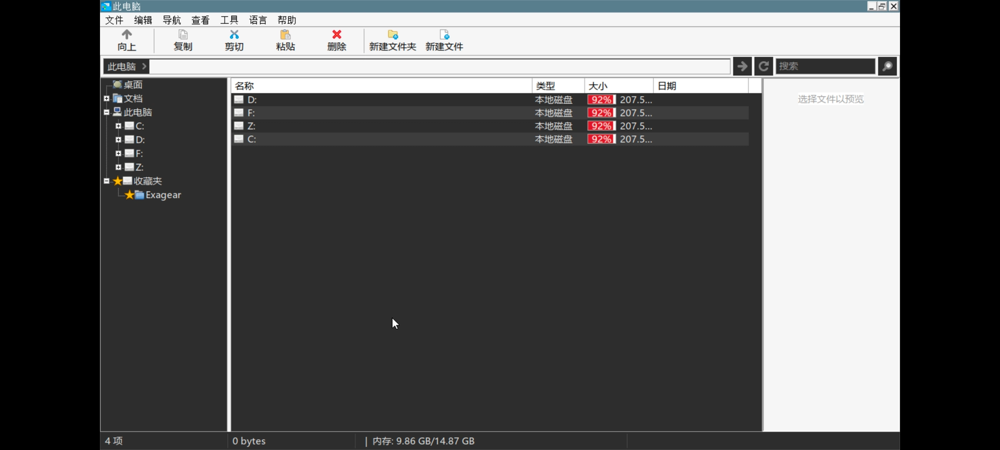
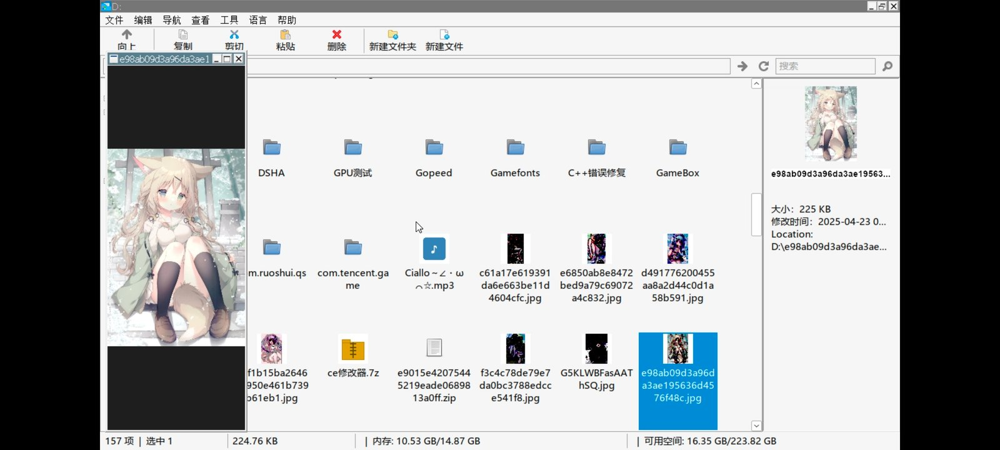
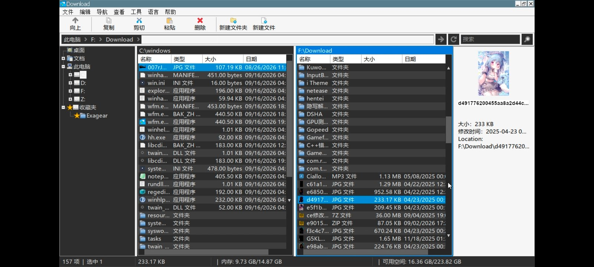
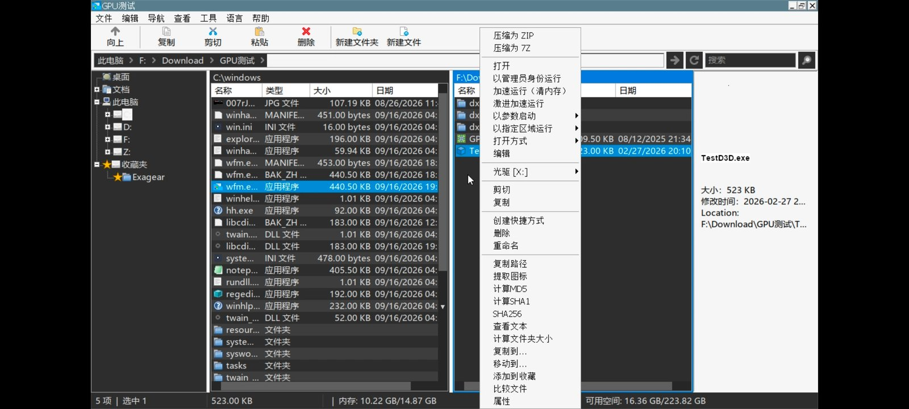

# BFM 中文美化版

> Banner File Manager 的中文增强分支，专为 Winlator / Wine 桌面环境优化。比原版更美观、更好用、更稳定。

[](https://www.gnu.org/licenses/gpl-3.0)
[](https://github.com/mihsian77/bfm-zh/releases)
[](https://github.com/mihsian77/bfm-zh/actions)
[]()

基于 [The412Banner/banner-file-manager](https://github.com/The412Banner/banner-file-manager) v1.2.1 开发，遵循 GPL-3.0 协议。

---

## 📑 目录

- [界面预览](#-界面预览)
- [主要特性](#-主要特性)
- [快速安装](#-快速安装)
- [7-Zip 集成](#-7-zip-集成)
- [实验性功能](#-实验性功能说明)
- [自行构建](#-自行构建)
- [许可证](#-许可证)
- [致谢](#-致谢)

---

## 🖼️ 界面预览

| | |
|---|---|
|  |  |
| 深色主题 · 磁盘容量条 · 存储信息 | 智能图标识别 · 图片缩略图 |
|  |  |
| 双面板 · 预览窗格 · 文件属性 | 压缩/加速/启动参数/转区/提取图标 |

---

## ✨ 主要特性

### 📁 文件管理
- **双面板**：左右独立浏览，支持跨面板复制/移动，文件可直接拖入外部程序（如 AlphaRom）
- **四种视图**：大图标 / 小图标 / 列表 / 详细信息，每种视图均可按名称/类型/大小/日期排序
- **收藏夹**：独立彩色星标图标，快速访问常用目录
- **预览窗格**：图片缩略预览、文本内容预览、文件属性（大小/修改时间/位置）
- **拖拽操作**：面板内移动、面板间复制、拖到外部程序运行

### 🎨 智能图标
- **图片文件**：自动生成缩略图预览，不依赖系统图标
- **格式识别**：音乐、视频、压缩包、文档、表格、演示、脚本、配置等均有独特图标
- **exe 图标增强**：优先从 exe 直接提取原生图标，失败自动查找同目录 `.ico`，解决 Wine 下图标丢失问题
- **三级缓存**：图标缓存机制，滚动流畅不卡顿

### 📦 压缩包操作（需 7-Zip）
- 解压到当前文件夹 / 解压到同名文件夹
- 测试压缩包完整性
- 压缩为 ZIP / 7Z
- 解压进度窗口实时显示

### 🎮 游戏启动辅助
- **加速启动**：均衡 / 激进两种模式，清理内存后启动游戏
- **启动参数预设**：窗口化、全屏、无边框、DX11、D3D9、Vulkan、单线程、帧率限制等，支持自定义参数
- **转区启动**：模拟指定区域运行日区 Galgame（实验性）
- **提取图标**：从 exe 提取原生图标保存为 BMP
- **以管理员身份运行**

### 🛠️ 系统工具
- 哈希计算（MD5 / SHA1 / SHA256）
- 批量重命名
- 新建文件（txt / bat / reg）
- 双面板内容对比
- 计算文件夹大小
- 调用 Winlator 自带任务管理器

### 🎨 界面优化
- 完整中文汉化（保留英文/葡萄牙语/俄语切换）
- **深色主题**：文件列表、左侧树、状态栏、搜索框全面深色化
- 字体大小可调
- 存储信息显示开关（磁盘容量条 / 状态栏内存）
- 设置持久化（主题、视图、收藏夹重启后保留）

---

## 🚀 快速安装

### 方式一：自动安装（推荐）
1. 从 [Releases](https://github.com/mihsian77/bfm-zh/releases) 下载最新 `bfm-zh-x64.zip`
2. 解压后双击运行 `安装.bat`
3. 脚本自动完成：关闭 WFM → 备份原版 → 部署 7-Zip 便携版 → 复制文件 → 启动 WFM

### 方式二：手动覆盖
1. 将 `wfm.exe` 和 `libcdio.dll` 复制到 Winlator 的 `C:\windows\` 目录
2. 覆盖原有文件（建议先备份）

---

## 📦 7-Zip 集成

解压/压缩功能需要 7-Zip。发布包已内置完整便携版，安装脚本自动部署。

### 自动部署（推荐）
安装脚本自动检测 `Z:\opt\apps\7-Zip\7z.exe`，不存在则从发布包的 `7-Zip/` 目录复制全部文件。

### 手动部署
将 `7z.exe` + `7z.dll` 及其他文件放入以下任一目录：
- `Z:\opt\apps\7-Zip\`（推荐）
- `C:\Program Files\7-Zip\`
- `C:\7-Zip\`
- 或 PATH 环境变量中的任意目录

### 支持的格式
- **解压**：7Z, ZIP, RAR, TAR, GZ, BZ2 等
- **压缩**：ZIP, 7Z
- **测试**：校验压缩包完整性

---

## 🔄 卸载还原

运行 `卸载还原.bat`，自动恢复备份的原版文件。

---

## ⚠️ 实验性功能说明

以下功能正在测试中，可能因游戏/容器配置不同而效果不一：

| 功能 | 说明 |
|------|------|
| **转区启动** | 通过环境变量模拟区域，部分 Galgame 可用，可能与容器编码设置冲突 |
| **自适应窗口 / 全屏启动** | 通过启动参数控制显示模式，部分游戏可能不支持 |
| **加速启动** | 清理内存后启动游戏，效果因游戏而异，激进模式可能导致不稳定 |
| **拖拽到外部程序** | 依赖 Wine 的 OLE 拖放支持，个别程序可能无响应 |

---

## 🔧 自行构建

```bash
# 依赖：mingw-w64
sudo apt install gcc-mingw-w64-x86-64

# 编译
make

# 或使用 GitHub Actions
# 推送代码到 main 分支后自动构建，产物在 Actions / nightly 预发布页面下载
```

### 构建参数
- 编译器：`x86_64-w64-mingw32-gcc`
- 标准：`c99`
- 优化：`-O2`
- 链接：`-lcomctl32 -lgdi32 -lole32 -loleaut32 -luuid -luxtheme -lshlwapi -lcrypt32 -lmsimg32`

---

## 📋 版本历史

| 版本 | 主要内容 |
|------|---------|
| **v1.2.1-zh.4** | 覆盖确认修复 + 7-Zip 便携版集成 + 安装脚本优化（当前） |
| v1.2.1-zh.3 | 深色主题 + 全视图图标 + 7-Zip 集成 + 安装脚本修复 |
| v1.2.1-zh.2 | 右键增强 + 预览窗格 + 稳定性优化 |
| v1.2.1-zh.1 | 基础汉化 + 双面板 + 收藏夹 |

---

## ⚖️ 许可证

GPL-3.0-or-later

本项目基于 Banner File Manager 修改，保留原作者版权。7-Zip 为独立软件，遵循其自身许可证（LGPL + unRAR 限制），本项目仅通过命令行调用，不构成衍生作品。

---

## 🙏 致谢

- [The412Banner](https://github.com/The412Banner) — Banner File Manager 原作者
- [BrunoSX](https://github.com/brunodev85) — WFM 原始作者（MIT）
- [ip7z/7zip](https://github.com/ip7z/7zip) — 7-Zip 官方仓库

---

**如果这个项目对你有帮助，欢迎给个 ⭐ Star！**
